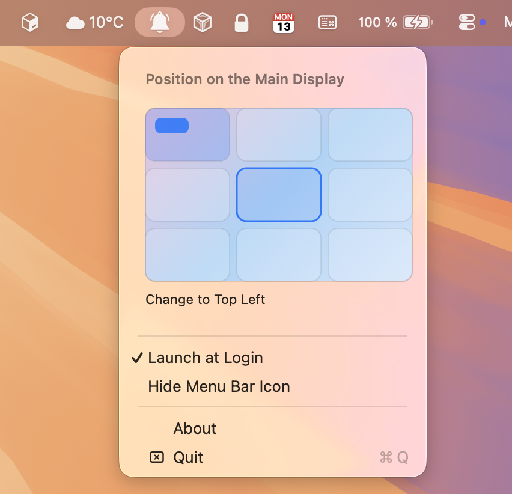
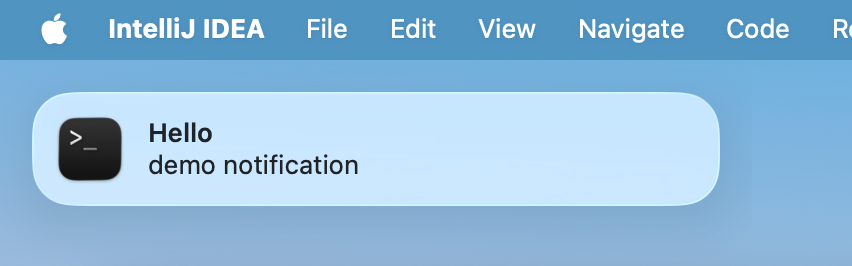

# PingPlace

Control notification position on macOS.

| Menu | Notification moved |
| --- | --- |
|  |  |

As seen in [Lifehacker](https://lifehacker.com/tech/change-where-macos-notifications-show-up)

## Fork changes

- Handles system sleep and lid close
- External monitors plug/unplug, including different resolutions
- Notification Center handling when swiping right to left or toggling it
- Recovery mechanisms for delayed notification availability
- New menu with a visual position picker
- On laptops, an option to target either the Main Display or the Laptop Display
- Split code into smaller components and added tests

## Installation

Local build only.
Clone, then build.

## Usage

The app needs accessibility permissions to work. It lives in the top bar. You can set notifications to appear in eight positions:

- Top Left
- Top Middle (default)
- Top Right (macOS default)
- Middle Left
- Middle Right
- Bottom Left
- Bottom Middle
- Bottom Right

For local development, debugging, and test workflows, see `CONTRIBUTING.md`.

## Requirements

- macOS 14 or later
- Accessibility permissions

## Support

Follow [@WadeGrimridge](https://x.com/WadeGrimridge) on X

## License

© 2025 All rights reserved.
