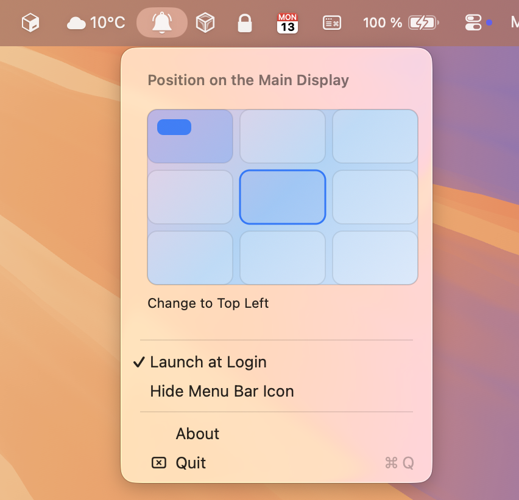
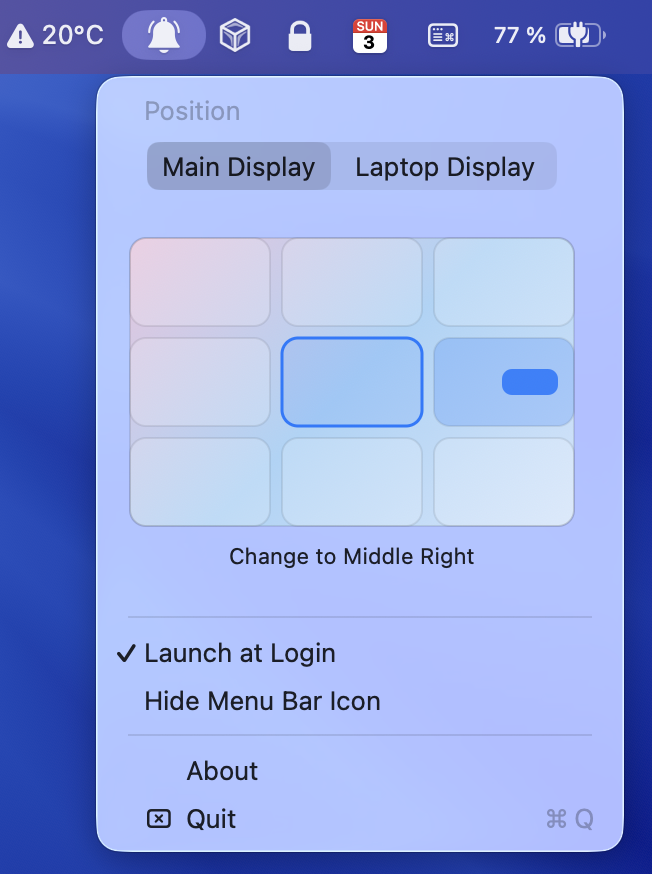
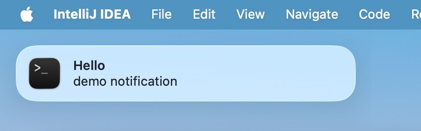

# PingPlace

Control notification position on macOS.

| Menu | Notification moved |
| --- | --- |
|   |  |

## Fork changes

This app is almost a complete rewrite to the original [PingPlace](https://github.com/NotWadeGrimridge/PingPlace), here's the change from 1.3.1.

- Handles system sleep and lid close
- External monitors plug/unplug, including different resolutions
- Notification Center handling when swiping right to left or toggling it
- Recovery mechanisms for delayed notification availability
- New menu with a visual position picker
- On laptops, an option to target either the Main Display or the Laptop Display
- Split code into smaller components and added tests

## Installation

Clone, build with `make build`, then copy to `/Applications` or `$HOME/Applications` folder.

XCode is needed.

Hidden settings:

- Enable debug logs:
  - `defaults write com.grimridge.PingPlace debugMode -bool true`
- Disable debug logs:
  - `defaults write com.grimridge.PingPlace debugMode -bool false`
- Debug log path:
  - `~/Library/Logs/PingPlace/debug.log`
- Set notification position:
  - `defaults write com.grimridge.PingPlace notificationPosition -string deadCenter`
- Set notification display target:
  - `defaults write com.grimridge.PingPlace notificationDisplayTarget -string mainDisplay`
  - `defaults write com.grimridge.PingPlace notificationDisplayTarget -string builtInDisplay`
- Show the `Rerun Detection` menu item:
  - `defaults write com.grimridge.PingPlace showRerunDetectionMenuItem -bool true`
- Hide the `Rerun Detection` menu item:
  - `defaults write com.grimridge.PingPlace showRerunDetectionMenuItem -bool false`

## Usage

The app needs accessibility permissions to work. It lives in the top bar. You can set notifications to appear in nine positions:

- Top Left
- Top Center (default)
- Top Right (macOS default)
- Middle Left
- Middle Center
- Middle Right
- Bottom Left
- Bottom Center
- Bottom Right

For local development, debugging, and test workflows, see `CONTRIBUTING.md`.

## Requirements

- macOS 14 or later
- Accessibility permissions

## License

Original app by [Wade Grimridge](https://github.com/NotWadeGrimridge/PingPlace).

Fork and later evolutions by bric3.

Original work © 2025 Wade Grimridge.

Fork changes © 2026 bric3.

All rights reserved.
